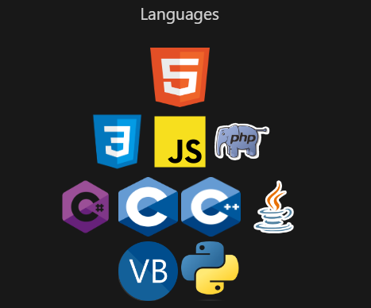
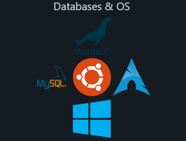

# About me

    Hi, my name is Benjamin, i'm 20.
    I'm  a self-taught developper since  12
    years now, i felt love about code when i was 8.
    I started by basics Web languages : HTML, CSS, PHP,
    then i got learned some strongers languages like C & C++.
    That was pretty much hard than web languages but was much fun
    too, so i kept going in this way, but you know, console applications..
    Therefore i discovered Visual Basic, yes, this language was really lazy but
    for the kid i was, this was a revolution, i was finally able to create
    some GUI interface, so, i did it for 2 years on VB, and i was happy
    about that, i discovered C# afterwards and i felt in love of this.
    I'm on C# from 6 years now, i guess, i continue to learn some
    other languages, but C# is still my favorite language ATM.
    I'm actually learning JavaScript now, so i understand
    a little much better why everybody say : 'LMAO, 
    Javascript's drunk', yeah, he's really 
    drunk but, it's fun because i keep
    learning, some new stuffs
    on programmation.

    
    

    
    

